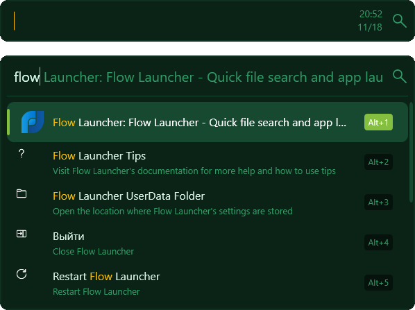
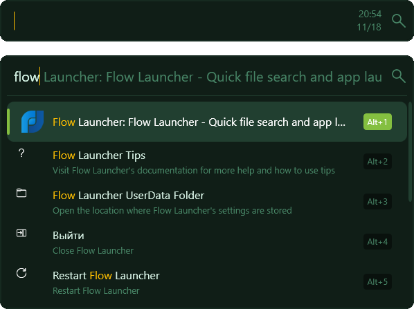
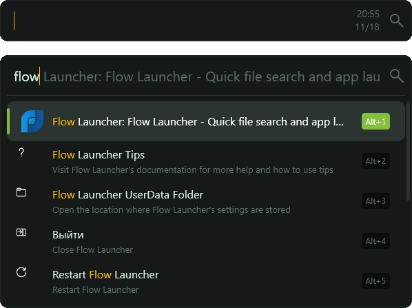

<div align="center">
  
  <h1>for Flow Launcher</h1>
</div>

<div align="center">
  <h2>Mojito Pro</h2>
  
</div>
<div align="center">
  <h2>Mojito Pro Dark</h2>
  
</div>
<div align="center">
  <h2>Mojito Pro Night</h2>
  
</div>

## Getting started

> You can download and install the **Flow Launcher** [https://github.com/Flow-Launcher/Flow.Launcher](https://github.com/Flow-Launcher/Flow.Launcher)

## ⚙️ Installation

1. Open **Windows Terminal**, **PowerShell** or **Git Bash** and run:

    * Mojito Pro

    ```PowerShell
    cd ~/AppData/Roaming/FlowLauncher/Themes
    curl -o MojitoPro.xaml https://raw.githubusercontent.com/mishatoshi/mojito-pro-flowlauncher-theme/refs/heads/main/themes/MojitoPro.xaml

    ```

    * Mojito Pro Dark

    ```PowerShell
    cd ~/AppData/Roaming/FlowLauncher/Themes
    curl -o MojitoProDark.xaml https://raw.githubusercontent.com/mishatoshi/mojito-pro-flowlauncher-theme/refs/heads/main/themes/MojitoProDark.xaml

    ```

    * Mojito Pro Night

    ```PowerShell
    cd ~/AppData/Roaming/FlowLauncher/Themes
    curl -o MojitoProNight.xaml https://raw.githubusercontent.com/mishatoshi/mojito-pro-flowlauncher-theme/refs/heads/main/themes/MojitoProNight.xaml

    ```

1. Restart the **Flow Launcher** `F5`
1. Go to **Flow launcher > Settings** `Ctrl + I` > **Appearance** > **Theme** and select **Mojito Pro** or **Mojito Pro Dark** or **Mojito Pro Night**.

## Other versions

* Visual Studio Code [https://github.com/mishatoshi/mojito-pro-vscode-theme](https://github.com/mishatoshi/mojito-pro-vscode-theme)
* Windows Terminal, PowerShell, CMD: [https://github.com/mishatoshi/mojito-pro-windows-terminal](https://github.com/mishatoshi/mojito-pro-windows-terminal)
* Oh My Posh [https://github.com/mishatoshi/mojito-pro-oh-my-posh-theme](https://github.com/mishatoshi/mojito-pro-oh-my-posh-theme)

## License

[MIT License](./LICENSE)

<h3 align="center">Don’t worry, be happy😍</h3>
